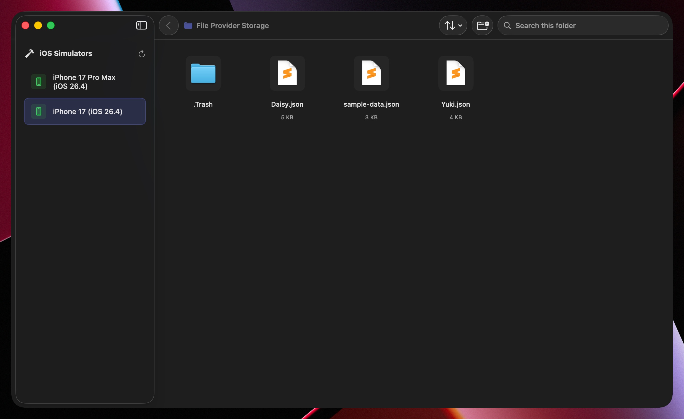

# SimFiles

A native macOS app to manage files in the iOS Simulator's Files app storage, with Finder drag-and-drop, a Liquid Glass UI, breadcrumb navigation, search, and sort



## Features
- **Simulator detection**: auto-discovers booted iOS simulators via `xcrun simctl`
- **File browser**: adaptive grid with icons, sizes, and a clickable breadcrumb path
- **Drag and drop**: drop files from Finder straight into the simulator's storage
- **File operations**: copy, cut, paste, rename, delete, create folders, with overwrite confirmation
- **Search and sort**: filter the current folder, sort by name, size, or date modified
- **Liquid Glass**: native macOS 26 toolbar with glassy chips and capsules

## Install
```bash
brew install rursache/tap/simfiles
```
First launch shows a Gatekeeper warning because the build is not yet notarized. Right-click `SimFiles.app` in Finder and pick **Open**, then **Open** again in the dialog. Subsequent launches go through normally

## Requirements
- macOS 26.0 (Tahoe) or later
- Xcode installed (provides `xcrun simctl`)

## How to use
1. Start any iOS simulator from Xcode
2. Launch SimFiles and pick a booted simulator in the sidebar
3. Browse the grid, drag files in from Finder, or use the toolbar to create folders, sort, and search
4. Right-click a file for copy, cut, rename, or delete
5. Click any breadcrumb segment to jump back up the tree

## How it works
1. `xcrun simctl list devices booted --json` lists booted simulators
2. `xcrun simctl listapps <udid>` returns the apps' container map (plist)
3. SimFiles reads `com.apple.DocumentsApp.GroupContainers["group.com.apple.FileProvider.LocalStorage"]` to locate the Files app's `File Provider Storage` folder
4. The grid is a regular file browser over that folder, with live updates via `FileMonitor`

## Building
Open `SimFiles.xcodeproj` in Xcode and run (⌘R)

Marketing version is set in target build settings; the build number auto-increments each build from `SupportiveFiles/build.xcconfig` via a script phase

## Limitations
- Only sees booted simulators
- Requires the Files app to be installed on the simulator
- Scope is the Files app's LocalStorage container; doesn't touch other app sandboxes

## License
MIT, see [LICENSE](LICENSE)
